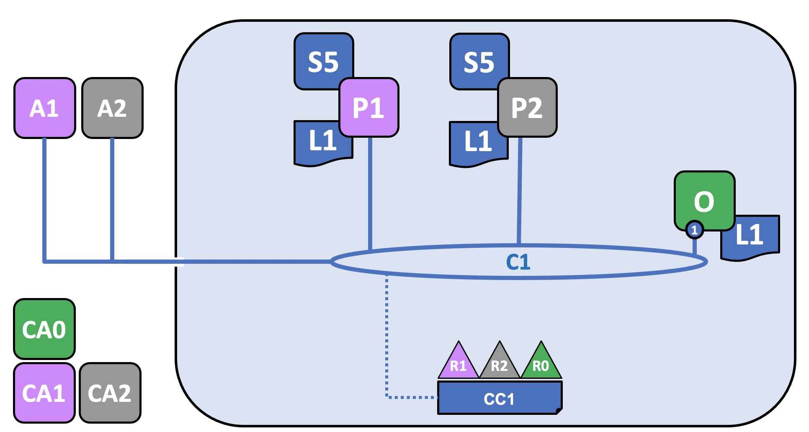

# blockchain-health-identity

## Prerequisites 

### Install Dependencies (WINDOWS 11/ LINUX)

1. [Docker](https://docs.docker.com/get-docker/)
2. [WSL](https://docs.microsoft.com/en-us/windows/wsl/install)

- If installing for the first time

  ```bash
  wsl --install
  ```

  else install the Ubuntu Linux distribution

  ```bash
  wsl --install -d Ubuntu
  ```

- set the default verion to WSL 2
  ```bash
  wsl --set-default-version 2
  ```
- list your installed Linux distributions
  ```bash
  wsl -l -v
  ```
- set the default Linux distribution to Ubuntu
  ```bash
  wsl -s Ubuntu
  ```
- setup docker wsl integration (Docker Settings -> Resources -> WSL Integration). Over there, check the "WSL Integration" box. The WSL2 linux distribution (Ubuntu) should pop up. Check it and restart Docker

3. Install [Git](https://git-scm.com/downloads)

- Update the following git configurations

```bash
git config --global core.autocrlf false
git config --global core.longpaths true
```
### Install Dependencies (MAC)
1. Install Homwebrew

```bash
/bin/bash -c "$(curl -fsSL https://raw.githubusercontent.com/Homebrew/install/master/install.sh)"
brew --version
```

2. Install Git

```bash
brew install git
git --version
```

3. Install cURL

```bash
brew install curl
$ curl --version
```

4. Install JQ

```bash
brew install jq
jq --version
```

5. Install Docker. If the following commands do not work, install via executable from the [website](https://docs.docker.com/get-docker/)

```bash
brew install --cask --appdir="/Applications" docker
open /Applications/Docker.app
docker --version
docker-compose --version
```
### Install Fabric and Fabric Samples

Clone a repo called "fabric samples". This will install Fabric samples, docker images & binaries

```bash
curl -sSL https://bit.ly/2ysbOFE | bash -s
```

## Using the Fabric test network (WINDOWS 11/ LINUX/ MAC)

1. Navigate to the test-network folder

```bash
cd fabric-samples/test-network
```

2. Clean up any previously run containers before bringing up a new container (Good Practice!). This will create 2 peer nodes, one ordering node

- Peer nodes store the blockchain ledger and validate transactions by running the smart contracts
- Ordering nodes handle the order of transactions and add them to blocks which are distributed to peer nodes

```bash
./network.sh down
./network.sh up
```

- When trying to start a network, the following error might pop up

```bash
"Error response from daemon: mkdir C:\Program Files\Git\var: Access is denied."
```

### Solution

Reproduce the following steps for 2 directories

- C:\Users\\[username]\.docker
- C:\Program Files\Git

Right click the directory -> Properties -> Security -> Edit -> Add -> Type "users" in the text box -> Check Names -> Ok -> Highlight the newly added group and check "Full Control" under "Permissions" -> Apply -> Ok -> Ok

3.  To verify, list all running docker containers

```bash
docker ps -a
```

4. Create a channel ("mychannel" by default) to join the 2 peer nodes

```bash
./network.sh createChannel
```

5. Run chaincode (JavaScript) on the channel. This chaincode is stored in the directory "../asset-transfer-basic/chaincode-javascript"

```bash
./network.sh deployCC -ccn basic -ccp ../asset-transfer-basic/chaincode-javascript -ccl javascript
```

- The Go Chaincode has issues with versioning. So a switch to the JavaScript Chaincode was made. More details [here](https://stackoverflow.com/questions/65224577/error-deploying-chaincode-in-hyperledger-fabric-2)!

### Interacting with the Network

1. Add the binaries we installed at the beginning to the CLI

```bash
export PATH=${PWD}/../bin:$PATH
export FABRIC_CFG_PATH=$PWD/../config/
```

2. Export the following environment variables for org1

```bash
# Environment variables for Org1
export CORE_PEER_TLS_ENABLED=true
export CORE_PEER_LOCALMSPID="Org1MSP"
export CORE_PEER_TLS_ROOTCERT_FILE=${PWD}/organizations/peerOrganizations/org1.example.com/peers/peer0.org1.example.com/tls/ca.crt
export CORE_PEER_MSPCONFIGPATH=${PWD}/organizations/peerOrganizations/org1.example.com/users/Admin@org1.example.com/msp
export CORE_PEER_ADDRESS=localhost:7051
```

3. Initialize the ledger with an initial list of assets. This will invoke the "InitLedger" function of the JavaScript chaincode

```bash
peer chaincode invoke -o localhost:7050 --ordererTLSHostnameOverride orderer.example.com --tls --cafile "${PWD}/organizations/ordererOrganizations/example.com/orderers/orderer.example.com/msp/tlscacerts/tlsca.example.com-cert.pem" -C mychannel -n basic --peerAddresses localhost:7051 --tlsRootCertFiles "${PWD}/organizations/peerOrganizations/org1.example.com/peers/peer0.org1.example.com/tls/ca.crt" --peerAddresses localhost:9051 --tlsRootCertFiles "${PWD}/organizations/peerOrganizations/org2.example.com/peers/peer0.org2.example.com/tls/ca.crt" -c '{"function":"InitLedger","Args":[]}'
```

2. Query the ledger to get the list of assets/a specific asset

```bash
peer chaincode query -C mychannel -n basic -c '{"Args":["GetAllAssets"]}'
```

3. Change the owner of an asset on the ledger by invoking the chaincode function "TransferAsset"

```bash
peer chaincode invoke -o localhost:7050 --ordererTLSHostnameOverride orderer.example.com --tls --cafile "${PWD}/organizations/ordererOrganizations/example.com/orderers/orderer.example.com/msp/tlscacerts/tlsca.example.com-cert.pem" -C mychannel -n basic --peerAddresses localhost:7051 --tlsRootCertFiles "${PWD}/organizations/peerOrganizations/org1.example.com/peers/peer0.org1.example.com/tls/ca.crt" --peerAddresses localhost:9051 --tlsRootCertFiles "${PWD}/organizations/peerOrganizations/org2.example.com/peers/peer0.org2.example.com/tls/ca.crt" -c '{"function":"TransferAsset","Args":["asset6","Christopher"]}'
```


4. Export the following environment variables for org2

```bash
# Environment variables for Org2
export CORE_PEER_TLS_ENABLED=true
export CORE_PEER_LOCALMSPID="Org2MSP"
export CORE_PEER_TLS_ROOTCERT_FILE=${PWD}/organizations/peerOrganizations/org2.example.com/peers/peer0.org2.example.com/tls/ca.crt
export CORE_PEER_MSPCONFIGPATH=${PWD}/organizations/peerOrganizations/org2.example.com/users/Admin@org2.example.com/msp
export CORE_PEER_ADDRESS=localhost:9051
```

5. Query the asset transfer on org2

```bash
peer chaincode query -C mychannel -n basic -c '{"Args":["ReadAsset","asset6"]}'
```

6. Bring down the network

```bash
./network.sh down
```

## Deploying a smart contract to a channel (WINDOWS 11/ LINUX/ MAC)

### Package the smart contract

1. Start the network

```bash
./network.sh up
```

2. Create a channel

```bash
./network.sh createChannel
```

3. Package the smart contract by installing the smart contract dependencies in the following directory

```bash
cd ../asset-transfer-basic/chaincode-javascript

npm install
```

4. Navigate back to ./test-network directory and add the binaries we installed at the beginning to utilize the peer CLI

```bash
cd ../../test-network
export PATH=${PWD}/../bin:$PATH
export FABRIC_CFG_PATH=$PWD/../config/
```

5. Create the chaincode package in the current directory (basic.tar.gz)

```bash
peer lifecycle chaincode package basic.tar.gz --path ../asset-transfer-basic/chaincode-javascript/ --lang node --label basic_1.0
```

### Install the chaincode

1. Export the following environment variables for org1

```bash
# Environment variables for Org1
export CORE_PEER_TLS_ENABLED=true
export CORE_PEER_LOCALMSPID="Org1MSP"
export CORE_PEER_TLS_ROOTCERT_FILE=${PWD}/organizations/peerOrganizations/org1.example.com/peers/peer0.org1.example.com/tls/ca.crt
export CORE_PEER_MSPCONFIGPATH=${PWD}/organizations/peerOrganizations/org1.example.com/users/Admin@org1.example.com/msp
export CORE_PEER_ADDRESS=localhost:7051
```

2. Install the chaincode on peer1. On success, the peer will generate and return the package identifier

```bash
peer lifecycle chaincode install basic.tar.gz
```

3. Export the following environment variables for org2

```bash
# Environment variables for Org2

export CORE_PEER_LOCALMSPID="Org2MSP"
export CORE_PEER_TLS_ROOTCERT_FILE=${PWD}/organizations/peerOrganizations/org2.example.com/peers/peer0.org2.example.com/tls/ca.crt
export CORE_PEER_MSPCONFIGPATH=${PWD}/organizations/peerOrganizations/org2.example.com/users/Admin@org2.example.com/msp
export CORE_PEER_ADDRESS=localhost:9051
```

4. Install the chaincode on peer2. On success,

```bash
peer lifecycle chaincode install basic.tar.gz
```

### Approve a chaincode definition

1. Find the package ID of the chaincode

```bash
peer lifecycle chaincode queryinstalled
```

2. Save the package ID as an environment variable. The package ID is different for every user so be sure to paste your own package ID.

```bash
export CC_PACKAGE_ID= <insert_package_id>
```

3. Approve the chaincode definition as org2

```bash
peer lifecycle chaincode approveformyorg -o localhost:7050 --ordererTLSHostnameOverride orderer.example.com --channelID mychannel --name basic --version 1.0 --package-id $CC_PACKAGE_ID --sequence 1 --tls --cafile "${PWD}/organizations/ordererOrganizations/example.com/orderers/orderer.example.com/msp/tlscacerts/tlsca.example.com-cert.pem"
```

4. Set the following environment variables to operate as the Org1 admin

```bash
export CORE_PEER_LOCALMSPID="Org1MSP"
export CORE_PEER_MSPCONFIGPATH=${PWD}/organizations/peerOrganizations/org1.example.com/users/Admin@org1.example.com/msp
export CORE_PEER_TLS_ROOTCERT_FILE=${PWD}/organizations/peerOrganizations/org1.example.com/peers/peer0.org1.example.com/tls/ca.crt
export CORE_PEER_ADDRESS=localhost:7051
```

5. Approve the chaincode definition as org1

```bash
peer lifecycle chaincode approveformyorg -o localhost:7050 --ordererTLSHostnameOverride orderer.example.com --channelID mychannel --name basic --version 1.0 --package-id $CC_PACKAGE_ID --sequence 1 --tls --cafile "${PWD}/organizations/ordererOrganizations/example.com/orderers/orderer.example.com/msp/tlscacerts/tlsca.example.com-cert.pem"

```

### Committing the chaincode definition to the channel

1. Check whether channel members have approved the same chaincode definition

```bash
peer lifecycle chaincode checkcommitreadiness --channelID mychannel --name basic --version 1.0 --sequence 1 --tls --cafile "${PWD}/organizations/ordererOrganizations/example.com/orderers/orderer.example.com/msp/tlscacerts/tlsca.example.com-cert.pem" --output json
```

- On success, output should be something like this

  ```bash
  {
    "Approvals": {
        "Org1MSP": true,
        "Org2MSP": true
    }
  }
  ```

2. Since both organizations that are members of the channel have approved the same parameters, commit the chaincode definition to the channel

```bash
peer lifecycle chaincode commit -o localhost:7050 --ordererTLSHostnameOverride orderer.example.com --channelID mychannel --name basic --version 1.0 --sequence 1 --tls --cafile "${PWD}/organizations/ordererOrganizations/example.com/orderers/orderer.example.com/msp/tlscacerts/tlsca.example.com-cert.pem" --peerAddresses localhost:7051 --tlsRootCertFiles "${PWD}/organizations/peerOrganizations/org1.example.com/peers/peer0.org1.example.com/tls/ca.crt" --peerAddresses localhost:9051 --tlsRootCertFiles "${PWD}/organizations/peerOrganizations/org2.example.com/peers/peer0.org2.example.com/tls/ca.crt"


```

3. Confirm that the chaincode definition has been committed to the channel

```bash
peer lifecycle chaincode querycommitted --channelID mychannel --name basic --cafile "${PWD}/organizations/ordererOrganizations/example.com/orderers/orderer.example.com/msp/tlscacerts/tlsca.example.com-cert.pem"
```

- On success, output should be something like this
  ```bash
  Committed chaincode definition for chaincode 'basic' on channel 'mychannel':
  Version: 1.0, Sequence: 1, Endorsement Plugin: escc, Validation Plugin: vscc, Approvals: [Org1MSP: true, Org2MSP: true]
  ```

### Invoking the chaincode

1. Invoke the chaincode by creating an initial set of assets on the ledger

```bash
peer chaincode invoke -o localhost:7050 --ordererTLSHostnameOverride orderer.example.com --tls --cafile "${PWD}/organizations/ordererOrganizations/example.com/orderers/orderer.example.com/msp/tlscacerts/tlsca.example.com-cert.pem" -C mychannel -n basic --peerAddresses localhost:7051 --tlsRootCertFiles "${PWD}/organizations/peerOrganizations/org1.example.com/peers/peer0.org1.example.com/tls/ca.crt" --peerAddresses localhost:9051 --tlsRootCertFiles "${PWD}/organizations/peerOrganizations/org2.example.com/peers/peer0.org2.example.com/tls/ca.crt" -c '{"function":"InitLedger","Args":[]}'
```

2. Read the set of cars that were created by the chaincode

```bash
peer chaincode query -C mychannel -n basic -c '{"Args":["GetAllAssets"]}'
```

### Upgrading a smart contract

1. Set the environment variables needed to use the peer CLI and create another chaincode package in the current directory (basic_2.tar.gz)

```bash
export PATH=${PWD}/../bin:$PATH
export FABRIC_CFG_PATH=$PWD/../config/
export CORE_PEER_MSPCONFIGPATH=${PWD}/organizations/peerOrganizations/org1.example.com/users/Admin@org1.example.com/msp
peer lifecycle chaincode package basic_2.tar.gz --path ../asset-transfer-basic/chaincode-javascript/ --lang node --label basic_2.0
```

2. Set Environment variables to operate the peer as the Org1 admin

```bash
export CORE_PEER_TLS_ENABLED=true
export CORE_PEER_LOCALMSPID="Org1MSP"
export CORE_PEER_TLS_ROOTCERT_FILE=${PWD}/organizations/peerOrganizations/org1.example.com/peers/peer0.org1.example.com/tls/ca.crt
export CORE_PEER_MSPCONFIGPATH=${PWD}/organizations/peerOrganizations/org1.example.com/users/Admin@org1.example.com/msp
export CORE_PEER_ADDRESS=localhost:7051
```

3. Install the new chaincode package on the Org1 peer.

```bash
peer lifecycle chaincode install basic_2.tar.gz
```

4. Find the new package ID by querying our peer

```bash
peer lifecycle chaincode queryinstalled
```

- On success, output should be something like this
  ```bash
  Installed chaincodes on peer:
  Package ID: basic_2.0:c522b9ca4df9be460b8136444b317ee77603613ef4de022b72b16c5de8080a9b, Label: basic_2.0
  Package ID: basic_1.0:ee09716080838e1c287295df0f2c85ecf048b814932e478c14cc53a2615c5627, Label: basic_1.0
  ```

5. Save the new basic 2.0 package ID as a new environment variable. The package ID is different for every user so be sure to paste your own package ID instead of the one below

```bash
export NEW_CC_PACKAGE_ID= <insert_package_id>
```

6. Approve a new chaincode definition as Org1

```bash
peer lifecycle chaincode approveformyorg -o localhost:7050 --ordererTLSHostnameOverride orderer.example.com --channelID mychannel --name basic --version 2.0 --package-id $NEW_CC_PACKAGE_ID --sequence 2 --tls --cafile "${PWD}/organizations/ordererOrganizations/example.com/orderers/orderer.example.com/msp/tlscacerts/tlsca.example.com-cert.pem"
```

7. Set Environment variables to operate the peer as the Org2 admin

```bash
export CORE_PEER_LOCALMSPID="Org2MSP"
export CORE_PEER_TLS_ROOTCERT_FILE=${PWD}/organizations/peerOrganizations/org2.example.com/peers/peer0.org2.example.com/tls/ca.crt
export CORE_PEER_TLS_ROOTCERT_FILE=${PWD}/organizations/peerOrganizations/org2.example.com/peers/peer0.org2.example.com/tls/ca.crt
export CORE_PEER_MSPCONFIGPATH=${PWD}/organizations/peerOrganizations/org2.example.com/users/Admin@org2.example.com/msp
export CORE_PEER_ADDRESS=localhost:9051
```

8. Install the new chaincode package on the Org2 peer

```bash
peer lifecycle chaincode install basic_2.tar.gz
```

9. Approve the new chaincode definition for Org2

```bash
peer lifecycle chaincode approveformyorg -o localhost:7050 --ordererTLSHostnameOverride orderer.example.com --channelID mychannel --name basic --version 2.0 --package-id $NEW_CC_PACKAGE_ID --sequence 2 --tls --cafile "${PWD}/organizations/ordererOrganizations/example.com/orderers/orderer.example.com/msp/tlscacerts/tlsca.example.com-cert.pem"
```

10. Check if the chaincode definition with sequence 2 is ready to be committed to the channel

```bash
peer lifecycle chaincode checkcommitreadiness --channelID mychannel --name basic --version 2.0 --sequence 2 --tls --cafile "${PWD}/organizations/ordererOrganizations/example.com/orderers/orderer.example.com/msp/tlscacerts/tlsca.example.com-cert.pem" --output json
```

11. Upgrade the chaincode for Org2

```bash
peer lifecycle chaincode commit -o localhost:7050 --ordererTLSHostnameOverride orderer.example.com --channelID mychannel --name basic --version 2.0 --sequence 2 --tls --cafile "${PWD}/organizations/ordererOrganizations/example.com/orderers/orderer.example.com/msp/tlscacerts/tlsca.example.com-cert.pem" --peerAddresses localhost:7051 --tlsRootCertFiles "${PWD}/organizations/peerOrganizations/org1.example.com/peers/peer0.org1.example.com/tls/ca.crt" --peerAddresses localhost:9051 --tlsRootCertFiles "${PWD}/organizations/peerOrganizations/org2.example.com/peers/peer0.org2.example.com/tls/ca.crt"
```

12. Verify that the new chaincode has started on your peers

```bash
docker ps
```

- On success, output should be something like this
  ```bash
  CONTAINER ID   IMAGE                                                                                                                                                                    COMMAND                  CREATED          STATUS          PORTS                                                                    NAMES
  0f7c11597adf   dev-peer0.org1.example.com-basic_2.0-c522b9ca4df9be460b8136444b317ee77603613ef4de022b72b16c5de8080a9b-a3ad3f4f232233ba9148c46e0ba39977e54a119d026b5d328f81188cecaf4dc0   "docker-entrypoint.s…"   29 seconds ago   Up 28 seconds                                                                            dev-peer0.org1.example.com-basic_2.0-c522b9ca4df9be460b8136444b317ee77603613ef4de022b72b16c5de8080a9b
  80a5cad4b0c9   dev-peer0.org2.example.com-basic_2.0-c522b9ca4df9be460b8136444b317ee77603613ef4de022b72b16c5de8080a9b-f2bdfa435c6cbf56eecdbf801d44d724f7bff2ee6ce032e5d4833a19840dd7d3   "docker-entrypoint.s…"   29 seconds ago   Up 29 seconds                                                                            dev-peer0.org2.example.com-basic_2.0-c522b9ca4df9be460b8136444b317ee77603613ef4de022b72b16c5de8080a9b
  30c3d67d01bd   hyperledger/fabric-tools:latest                                                                                                                                          "/bin/bash"              28 minutes ago   Up 28 minutes                                                                            cli
  6bcd5a8d38e6   hyperledger/fabric-peer:latest                                                                                                                                           "peer node start"        28 minutes ago   Up 28 minutes   0.0.0.0:7051->7051/tcp, 0.0.0.0:9444->9444/tcp                           peer0.org1.example.com
  631a606a256f   hyperledger/fabric-orderer:latest
  ```

13. Test the new JavaScript chaincode by creating a new car and then query all the cars on the ledger

```bash
peer chaincode invoke -o localhost:7050 --ordererTLSHostnameOverride orderer.example.com --tls --cafile "${PWD}/organizations/ordererOrganizations/example.com/orderers/orderer.example.com/msp/tlscacerts/tlsca.example.com-cert.pem" -C mychannel -n basic --peerAddresses localhost:7051 --tlsRootCertFiles "${PWD}/organizations/peerOrganizations/org1.example.com/peers/peer0.org1.example.com/tls/ca.crt" --peerAddresses localhost:9051 --tlsRootCertFiles "${PWD}/organizations/peerOrganizations/org2.example.com/peers/peer0.org2.example.com/tls/ca.crt" -c '{"function":"CreateAsset","Args":["asset8","blue","16","Kelley","750"]}'

peer chaincode query -C mychannel -n basic -c '{"Args":["GetAllAssets"]}'

```

14. Clean up the network

```bash
./network.sh down
```

Here is a visual depiction of how the everything in the network is organized for the preceding tutorials



## Running a Fabric Application (WINDOWS11/ LINUX/ MAC)

1. Bring up a new network and create a new channel called mychannel

```bash
./network.sh up createChannel -c mychannel -ca
```

2. Deploy the chaincode package containing the TypeScript smart contract.

```bash
./network.sh deployCC -ccn basic -ccp ../asset-transfer-basic/chaincode-typescript/ -ccl typescript
```

3. Package the smart contract by installing the smart contract dependencies in the following directory

```bash
cd ../asset-transfer-basic/application-gateway-typescript

npm install
```

4. Start the sample application. Make sure to have the latest version of node installed

```bash
npm start
```

5. Navigate back to the test-network directory and clean up the network

```bash
cd ../../test-network
./network.sh down
```

## Creating a Channel using the test network (WINDOWS 11/ LINUX/ MAC)

1. Move into the test-network directory

```bash
cd test-network
```

2. Clean up previous network and bring a new one up

```bash
./network.sh down
./network.sh up
```

3. Add the binaries we installed at the beginning to the CLI and use a tool called configtxgen, create genesis block for channel1

```bash
export PATH=${PWD}/../bin:$PATH
export FABRIC_CFG_PATH=${PWD}/configtx
configtxgen -profile TwoOrgsApplicationGenesis -outputBlock ./channel-artifacts/channel1.block -channelID channel1
```

4. Set some environment variables and use a tool called osnadmin to create the application channel

```bash
export ORDERER_CA=${PWD}/organizations/ordererOrganizations/example.com/orderers/orderer.example.com/msp/tlscacerts/tlsca.example.com-cert.pem
export ORDERER_ADMIN_TLS_SIGN_CERT=${PWD}/organizations/ordererOrganizations/example.com/orderers/orderer.example.com/tls/server.crt
export ORDERER_ADMIN_TLS_PRIVATE_KEY=${PWD}/organizations/ordererOrganizations/example.com/orderers/orderer.example.com/tls/server.key
osnadmin channel join --channelID channel1 --config-block ./channel-artifacts/channel1.block -o localhost:7053 --ca-file "$ORDERER_CA" --client-cert "$ORDERER_ADMIN_TLS_SIGN_CERT" --client-key "$ORDERER_ADMIN_TLS_PRIVATE_KEY"
```
- On success, the output should look like this:

```bash
Status: 201
{
    "name": "channel1",
    "url": "/participation/v1/channels/channel1",
    "consensusRelation": "consenter",
    "status": "active",
    "height": 1
}
```

5. List channels on an orderer

```bash
osnadmin channel list -o localhost:7053 --ca-file "$ORDERER_CA" --client-cert "$ORDERER_ADMIN_TLS_SIGN_CERT" --client-key "$ORDERER_ADMIN_TLS_PRIVATE_KEY"
```

- On successm the output look like this:

```bash
Status: 200
{
    "systemChannel": null,
    "channels": [
        {
            "name": "channel1",
            "url": "/participation/v1/channels/channel1"
        }
    ]
}
```

6. Set some environment variables to take on Org1's identity, add binaries for using the peer CLI and join peer node "Org1" to the channel

```bash
export CORE_PEER_TLS_ENABLED=true
export CORE_PEER_LOCALMSPID="Org1MSP"
export CORE_PEER_TLS_ROOTCERT_FILE=${PWD}/organizations/peerOrganizations/org1.example.com/peers/peer0.org1.example.com/tls/ca.crt
export CORE_PEER_MSPCONFIGPATH=${PWD}/organizations/peerOrganizations/org1.example.com/users/Admin@org1.example.com/msp
export CORE_PEER_ADDRESS=localhost:7051

export FABRIC_CFG_PATH=$PWD/../config/

peer channel join -b ./channel-artifacts/channel1.block
```

7. Set some environment variables to take on Org2's identity, add binaries for using the peer CLI and join peer node "Org2" to the channel

```bash
export CORE_PEER_LOCALMSPID="Org2MSP"
export CORE_PEER_TLS_ROOTCERT_FILE=${PWD}/organizations/peerOrganizations/org2.example.com/peers/peer0.org2.example.com/tls/ca.crt
export CORE_PEER_MSPCONFIGPATH=${PWD}/organizations/peerOrganizations/org2.example.com/users/Admin@org2.example.com/msp
export CORE_PEER_ADDRESS=localhost:9051

peer channel join -b ./channel-artifacts/channel1.block

```
8. Set environment variables for Org1 one of your peer nodes in Org1 to be anchor needs (needed for storing private data etc.)

```bash
export CORE_PEER_LOCALMSPID="Org1MSP"
export CORE_PEER_TLS_ROOTCERT_FILE=${PWD}/organizations/peerOrganizations/org1.example.com/peers/peer0.org1.example.com/tls/ca.crt
export CORE_PEER_MSPCONFIGPATH=${PWD}/organizations/peerOrganizations/org1.example.com/users/Admin@org1.example.com/msp
export CORE_PEER_ADDRESS=localhost:7051
```

9. Fetch the current channel configuration. All values should be 0 since we only have a genesis block so far.

```bash
peer channel fetch config channel-artifacts/config_block.pb -o localhost:7050 --ordererTLSHostnameOverride orderer.example.com -c channel1 --tls --cafile "$ORDERER_CA"
```

10. Move into channel-artifacts directory. The channel configuration block (config_block.pb) is stored here

```bash
cd channel-artifacts
```

11. Using a tool called configtxlator, convert the protobuf file to json and strip away metadata. This will also create config_block.json and config.json respectively.

```bash
configtxlator proto_decode --input config_block.pb --type common.Block --output config_block.json
jq '.data.data[0].payload.data.config' config_block.json > config.json
```

12. Make a copy of the config.json file

```bash
cp config.json config_copy.json
```

13. Use a tool called jq to add the Org1 anchor peer to the channel configuration. This will create modified_config.json

 ```bash
 jq '.channel_group.groups.Application.groups.Org1MSP.values += {"AnchorPeers":{"mod_policy": "Admins","value":{"anchor_peers": [{"host": "peer0.org1.example.com","port": 7051}]},"version": "0"}}' config_copy.json > modified_config.json
```

12. Convert the 2 .json files into protobuf (.pb) files again. This will create config.pb and modified_config.pb

```bash
configtxlator proto_encode --input config.json --type common.Config --output config.pb
configtxlator proto_encode --input modified_config.json --type common.Config --output modified_config.pb
```

13. Calculate the difference between the contents of these protobuf files. This will create config_update.pb

```bash
configtxlator compute_update --channel_id channel1 --original config.pb --updated modified_config.pb --output config_update.pb
```

14. Convert the protobuf file into json file. This will create config_update.json. And then wrap the json with a transaction envelope. This will create config_update_in_envelope.pb

```bash
configtxlator proto_decode --input config_update.pb --type common.ConfigUpdate --output config_update.json

echo '{"payload":{"header":{"channel_header":{"channel_id":"channel1", "type":2}},"data":{"config_update":'$(cat config_update.json)'}}}' | jq . > config_update_in_envelope.json
configtxlator proto_encode --input config_update_in_envelope.json --type common.Envelope --output config_update_in_envelope.pb
```

15. Move back into the test-network directory. Add the anchor peer by providing the new channel configuration

```bash
cd ..
peer channel update -f channel-artifacts/config_update_in_envelope.pb -c channel1 -o localhost:7050  --ordererTLSHostnameOverride orderer.example.com --tls --cafile "${PWD}/organizations/ordererOrganizations/example.com/orderers/orderer.example.com/msp/tlscacerts/tlsca.example.com-cert.pem"
```

16. Switch to Org2

```bash
export CORE_PEER_LOCALMSPID="Org2MSP"
export CORE_PEER_TLS_ROOTCERT_FILE=${PWD}/organizations/peerOrganizations/org2.example.com/peers/peer0.org2.example.com/tls/ca.crt
export CORE_PEER_MSPCONFIGPATH=${PWD}/organizations/peerOrganizations/org2.example.com/users/Admin@org2.example.com/msp
export CORE_PEER_ADDRESS=localhost:9051
```

17. Fetch the current configuration block. All values should be 1 since we are on the 2nd block now.

```bash
peer channel fetch config channel-artifacts/config_block.pb -o localhost:7050 --ordererTLSHostnameOverride orderer.example.com -c channel1 --tls --cafile "${PWD}/organizations/ordererOrganizations/example.com/orderers/orderer.example.com/msp/tlscacerts/tlsca.example.com-cert.pem"
```

18. Move into channel-artifacts directory. The channel configuration block (config_block.pb) is stored here

```bash
cd channel-artifacts
```

19. Decode the block into json format, strip away metadata and copy the configuration block

```bash
configtxlator proto_decode --input config_block.pb --type common.Block --output config_block.json
jq '.data.data[0].payload.data.config' config_block.json > config.json
cp config.json config_copy.json
```

20. Add the Org2 peer to the channel as the anchor peer in the channel configuration:

```bash
jq '.channel_group.groups.Application.groups.Org2MSP.values += {"AnchorPeers":{"mod_policy": "Admins","value":{"anchor_peers": [{"host": "peer0.org2.example.com","port": 9051}]},"version": "0"}}' config_copy.json > modified_config.json
```

21. Convert both the original and updated channel configurations back into protobuf format and calculate the difference between them

```bash
configtxlator proto_encode --input config.json --type common.Config --output config.pb
configtxlator proto_encode --input modified_config.json --type common.Config --output modified_config.pb
configtxlator compute_update --channel_id channel1 --original config.pb --updated modified_config.pb --output config_update.pb
```

22. Convert protobuf into json, wrap the configuration update in a transaction envelope and convert it back into protobuf:

```bash
configtxlator proto_decode --input config_update.pb --type common.ConfigUpdate --output config_update.json
echo '{"payload":{"header":{"channel_header":{"channel_id":"channel1", "type":2}},"data":{"config_update":'$(cat config_update.json)'}}}' | jq . > config_update_in_envelope.json
configtxlator proto_encode --input config_update_in_envelope.json --type common.Envelope --output config_update_in_envelope.pb
```

23. Change back into test-network directory and update the channel by setting the Org2 anchor peer:

```bash
cd ..
peer channel update -f channel-artifacts/config_update_in_envelope.pb -c channel1 -o localhost:7050  --ordererTLSHostnameOverride orderer.example.com --tls --cafile "${PWD}/organizations/ordererOrganizations/example.com/orderers/orderer.example.com/msp/tlscacerts/tlsca.example.com-cert.pem"
```

24. Confirm that the channel has been successfully updated. Height of the channel should be 3.

```bash
peer channel getinfo -c channel1
```

25. Deploy a chaincode (JavaScript) to our new channel, initialize with some assets and confirm the addition of assets

```bash
./network.sh deployCC -ccn basic -ccp ../asset-transfer-basic/chaincode-javascript/ -ccl javascript -c channel1

peer chaincode invoke -o localhost:7050 --ordererTLSHostnameOverride orderer.example.com --tls --cafile "$ORDERER_CA" -C channel1 -n basic --peerAddresses localhost:7051 --tlsRootCertFiles "${PWD}/organizations/peerOrganizations/org1.example.com/peers/peer0.org1.example.com/tls/ca.crt" --peerAddresses localhost:9051 --tlsRootCertFiles "${PWD}/organizations/peerOrganizations/org2.example.com/peers/peer0.org2.example.com/tls/ca.crt" -c '{"function":"InitLedger","Args":[]}'

peer chaincode query -C channel1 -n basic -c '{"Args":["GetAllAssets"]}'
```

### Adding an org to a channel (WINDOWS 11/ LINUX)

1. Bringup network
```
cd fabric-samples/test-network
./network.sh up createChannel -c channel1
```

2. There are multiple ways to add another org to a channel. In our testwork there are 2 orgs already, the next org added will be org3. The basic two are with a script and without a script.

#### With script
- Use the script
```
cd addOrg3
./addOrg3.sh up -c channel1
```

- Success message:
```
Org3 peer successfully added to network
```

#### Without script

- Bring the network down
```
cd ..
./network.sh down
./network.sh up createChannel -c channel1
```

- Generate org3 crypto material
```
cd addOrg3
../../bin/cryptogen generate --config=org3-crypto.yaml --output="../organizations"
```

```
export FABRIC_CFG_PATH=$PWD
../../bin/configtxgen -printOrg Org3MSP > ../organizations/peerOrganizations/org3.example.com/org3.json
```

3. Bring up org3
```
docker-compose -f docker/docker-compose-org3.yaml up -d
```
- Success Message
```
Creating peer0.org3.example.com ... done
```

4. Fetch config
```
cd ..
peer channel fetch config channel-artifacts/config_block.pb -o localhost:7050 --ordererTLSHostnameOverride orderer.example.com -c channel1 --tls --cafile "${PWD}/organizations/ordererOrganizations/example.com/orderers/orderer.example.com/msp/tlscacerts/tlsca.example.com-cert.pem"
```

5. Convert config to json
```
cd channel-artifacts
configtxlator proto_decode --input config_block.pb --type common.Block --output config_block.json
jq .data.data[0].payload.data.config config_block.json > config.json
```

6. Add org3 crypto materials
```
jq -s '.[0] * {"channel_group":{"groups":{"Application":{"groups": {"Org3MSP":.[1]}}}}}' config.json ../organizations/peerOrganizations/org3.example.com/org3.json > modified_config.json
```

```
configtxlator proto_encode --input config.json --type common.Config --output config.pb
```

```
configtxlator proto_encode --input modified_config.json --type common.Config --output modified_config.pb
```

```
configtxlator compute_update --channel_id channel1 --original config.pb --updated modified_config.pb --output org3_update.pb
```

```
configtxlator proto_decode --input org3_update.pb --type common.ConfigUpdate --output org3_update.json
```

```
echo '{"payload":{"header":{"channel_header":{"channel_id":"'channel1'", "type":2}},"data":{"config_update":'$(cat org3_update.json)'}}}' | jq . > org3_update_in_envelope.json
```

```
configtxlator proto_encode --input org3_update_in_envelope.json --type common.Envelope --output org3_update_in_envelope.pb
```

7. Sign config
```
cd ..
peer channel signconfigtx -f channel-artifacts/org3_update_in_envelope.pb
```

```
export CORE_PEER_TLS_ENABLED=true
export CORE_PEER_LOCALMSPID="Org2MSP"
export CORE_PEER_TLS_ROOTCERT_FILE=${PWD}/organizations/peerOrganizations/org2.example.com/peers/peer0.org2.example.com/tls/ca.crt
export CORE_PEER_MSPCONFIGPATH=${PWD}/organizations/peerOrganizations/org2.example.com/users/Admin@org2.example.com/msp
export CORE_PEER_ADDRESS=localhost:9051
```

8. Update config
```
peer channel update -f channel-artifacts/org3_update_in_envelope.pb -c channel1 -o localhost:7050 --ordererTLSHostnameOverride orderer.example.com --tls --cafile "${PWD}/organizations/ordererOrganizations/example.com/orderers/orderer.example.com/msp/tlscacerts/tlsca.example.com-cert.pem"
```

```
2021-01-07 18:51:48.015 UTC [channelCmd] update -> INFO 002 Successfully submitted channel update
```

9. Join org3 to channel
```
export CORE_PEER_TLS_ENABLED=true
export CORE_PEER_LOCALMSPID="Org3MSP"
export CORE_PEER_TLS_ROOTCERT_FILE=${PWD}/organizations/peerOrganizations/org3.example.com/peers/peer0.org3.example.com/tls/ca.crt
export CORE_PEER_MSPCONFIGPATH=${PWD}/organizations/peerOrganizations/org3.example.com/users/Admin@org3.example.com/msp
export CORE_PEER_ADDRESS=localhost:11051
```
```
peer channel fetch 0 channel-artifacts/channel1.block -o localhost:7050 --ordererTLSHostnameOverride orderer.example.com -c channel1 --tls --cafile "${PWD}/organizations/ordererOrganizations/example.com/orderers/orderer.example.com/msp/tlscacerts/tlsca.example.com-cert.pem"
```

```
peer channel join -b channel-artifacts/channel1.block
```

```
peer channel joinbysnapshot --snapshotpath <path to snapshot>
```
10. config leader election
```
CORE_PEER_GOSSIP_USELEADERELECTION=false
CORE_PEER_GOSSIP_ORGLEADER=true
```

```
CORE_PEER_GOSSIP_USELEADERELECTION=true
CORE_PEER_GOSSIP_ORGLEADER=false
```


11. install chaincode

```
peer lifecycle chaincode package basic.tar.gz --path ../asset-transfer-basic/chaincode-go/ --lang golang --label basic_1
```

```
cd fabric-samples/test-network
./network.sh deployCC -ccn basic -ccp ../asset-transfer-basic/chaincode-go/ -ccl go -c channel1
```

```
export PATH=${PWD}/../bin:$PATH
export FABRIC_CFG_PATH=$PWD/../config/
export CORE_PEER_TLS_ENABLED=true
export CORE_PEER_LOCALMSPID="Org3MSP"
export CORE_PEER_TLS_ROOTCERT_FILE=${PWD}/organizations/peerOrganizations/org3.example.com/peers/peer0.org3.example.com/tls/ca.crt
export CORE_PEER_MSPCONFIGPATH=${PWD}/organizations/peerOrganizations/org3.example.com/users/Admin@org3.example.com/msp
export CORE_PEER_ADDRESS=localhost:11051
```

```
peer lifecycle chaincode package basic.tar.gz --path ../asset-transfer-basic/chaincode-go/ --lang golang --label basic_1
```

```
peer lifecycle chaincode install basic.tar.gz
```

```
peer lifecycle chaincode queryinstalled
```

```
Get installed chaincodes on peer:
Package ID: basic_1:5443b5b557efd3faece8723883d28d6f7026c0bf12245de109b89c5c4fe64887, Label: basic_1
```

12. Define Chaincode
```
export CC_PACKAGE_ID=basic_1:5443b5b557efd3faece8723883d28d6f7026c0bf12245de109b89c5c4fe64887
```

```
peer lifecycle chaincode approveformyorg -o localhost:7050 --ordererTLSHostnameOverride orderer.example.com --tls --cafile "${PWD}/organizations/ordererOrganizations/example.com/orderers/orderer.example.com/msp/tlscacerts/tlsca.example.com-cert.pem" --channelID channel1 --name basic --version 1.0 --package-id $CC_PACKAGE_ID --sequence 1
```

```
peer lifecycle chaincode querycommitted --channelID channel1 --name basic --cafile "${PWD}/organizations/ordererOrganizations/example.com/orderers/orderer.example.com/msp/tlscacerts/tlsca.example.com-cert.pem"

```

```
Committed chaincode definition for chaincode 'basic' on channel 'channel1':
Version: 1.0, Sequence: 1, Endorsement Plugin: escc, Validation Plugin: vscc, Approvals: [Org1MSP: true, Org2MSP: true, Org3MSP: true]
```

13. Invoke chaincode
```
peer chaincode invoke -o localhost:7050 --ordererTLSHostnameOverride orderer.example.com --tls --cafile "${PWD}/organizations/ordererOrganizations/example.com/orderers/orderer.example.com/msp/tlscacerts/tlsca.example.com-cert.pem" -C channel1 -n basic --peerAddresses localhost:9051 --tlsRootCertFiles "${PWD}/organizations/peerOrganizations/org2.example.com/peers/peer0.org2.example.com/tls/ca.crt" --peerAddresses localhost:11051 --tlsRootCertFiles "${PWD}/organizations/peerOrganizations/org3.example.com/peers/peer0.org3.example.com/tls/ca.crt" -c '{"function":"InitLedger","Args":[]}'
```

```
peer chaincode query -C channel1 -n basic -c '{"Args":["GetAllAssets"]}'
```

14. Update config with org3 anchor peers (optional)

```
peer channel fetch config channel-artifacts/config_block.pb -o localhost:7050 --ordererTLSHostnameOverride orderer.example.com -c channel1 --tls --cafile "${PWD}/organizations/ordererOrganizations/example.com/orderers/orderer.example.com/msp/tlscacerts/tlsca.example.com-cert.pem"
```

```
cd channel-artifacts
```

```
configtxlator proto_decode --input config_block.pb --type common.Block --output config_block.json
jq .data.data[0].payload.data.config config_block.json > config.json
```

```
jq '.channel_group.groups.Application.groups.Org3MSP.values += {"AnchorPeers":{"mod_policy": "Admins","value":{"anchor_peers": [{"host": "peer0.org3.example.com","port": 11051}]},"version": "0"}}' config.json > modified_anchor_config.json
```

```
configtxlator proto_encode --input config.json --type common.Config --output config.pb
```

```
configtxlator proto_encode --input modified_anchor_config.json --type common.Config --output modified_anchor_config.pb
```

```
configtxlator compute_update --channel_id channel1 --original config.pb --updated modified_anchor_config.pb --output anchor_update.pb
```

```
configtxlator proto_decode --input anchor_update.pb --type common.ConfigUpdate --output anchor_update.json
```

```
echo '{"payload":{"header":{"channel_header":{"channel_id":"channel1", "type":2}},"data":{"config_update":'$(cat anchor_update.json)'}}}' | jq . > anchor_update_in_envelope.json
```

```
configtxlator proto_encode --input anchor_update_in_envelope.json --type common.Envelope --output anchor_update_in_envelope.pb
```

```
cd ..
```

```
export CORE_PEER_LOCALMSPID="Org3MSP"
export CORE_PEER_TLS_ROOTCERT_FILE=${PWD}/organizations/peerOrganizations/org3.example.com/peers/peer0.org3.example.com/tls/ca.crt
export CORE_PEER_MSPCONFIGPATH=${PWD}/organizations/peerOrganizations/org3.example.com/users/Admin@org3.example.com/msp
export CORE_PEER_ADDRESS=localhost:11051
```

```
peer channel update -f channel-artifacts/anchor_update_in_envelope.pb -c channel1 -o localhost:7050 --ordererTLSHostnameOverride orderer.example.com --tls --cafile "${PWD}/organizations/ordererOrganizations/example.com/orderers/orderer.example.com/msp/tlscacerts/tlsca.example.com-cert.pem"
```

```
docker logs -f peer0.org1.example.com
```
